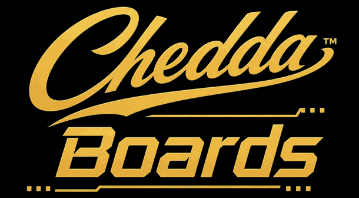

# CheddaBoards — Online Leaderboards for Godot

Give your players a reason to come back. CheddaBoards is leaderboards-as-a-service for Godot: you keep making your game, we run the backend. No server, no database, no credit card, no per-player fees — and the SDK is MIT, so nothing about your integration is locked in.

**Current version: 2.2.6** — see [CHANGELOG.md](CHANGELOG.md)

## Install

**From the Godot Asset Store (recommended):** install [CheddaBoards — Online Leaderboards](https://store.godotengine.org/asset/cheddatech/cheddaboards) via the in-editor asset browser, then enable **CheddaBoards** in Project Settings → Plugins (this registers the autoload for you).

**Manual:** copy the `addons/cheddaboards` folder from this repo into your project, then enable the plugin the same way.

## Quick start

1. Install and enable the plugin as above
2. Set your API key from the free dashboard — the included Setup Wizard (open `SetupWizard.gd`, File → Run) writes it into your main scene's script for you
3. In your game:

```gdscript
await CheddaBoards.wait_until_ready()
CheddaBoards.login_anonymous()      # no sign-up needed
CheddaBoards.submit_score(score)    # e.g. on game over
CheddaBoards.get_leaderboard()      # emits leaderboard_loaded
```

Your scores, achievements and sign-in are live — there is no server for you to run.

## What you get

* **Global leaderboards** — score + streak, top 100, the player's own rank via `get_player_rank()`
* **Timed boards done properly** — weekly / daily / monthly / custom-interval boards that reset on calendar boundaries and archive automatically, so past competitions are browsable, not lost
* **Category boards** — per-level, per-mode or per-difficulty leaderboards under one game, no separate registration per board
* **Achievements** — unlock individually or in batches, submit alongside scores, deferred sync built in; a full auto-unlock engine with offline caching and popups ships in the free template
* **Anonymous play, zero setup** — players submit scores with no account; they can link Google or Apple later and keep all progress
* **Device Code sign-in** — Google / Apple login on any platform via QR + code, no OAuth SDKs to bundle. Players sign in once and stay signed in across restarts and web reloads
* **Anti-cheat** — server-side play sessions, score validation, rate limiting, configurable caps
* **Score moderation** — delete junk entries or wipe a player from your boards straight from the dashboard, with a deletion audit log
* **Works everywhere Godot exports** — desktop, mobile and HTML5/web, including touch scrolling and mobile name entry
* **Battle-tested** — this exact SDK runs our own live arcade games in production

## Bring your own UI

This addon is the SDK — your leaderboard should look like your game. Wiring a display takes one signal connection and a few Labels. We added a full online leaderboard to the official Dodge the Creeps demo in ~60 lines — [tutorial + runnable example](https://github.com/cheddatech/cheddaboards-dodge-the-creeps).

## Want a full game shell instead?

If you're starting a fresh project, the free [CheddaBoards Template](https://store.godotengine.org/asset/cheddatech/cheddaboards-template/) wraps this SDK in finished MainMenu / Leaderboard / Achievements screens — your game just emits one `game_over` signal (~3 minutes). A [REST API](https://docs.cheddaboards.com/quickstart/rest) is also available for non-Godot engines.

## Requirements

* Godot 4.6 or newer (Godot 3.6 backport available)
* A free CheddaBoards account + API key from the dashboard at [cheddaboards.com](https://cheddaboards.com/)
* A Unity (C#) SDK is also available with full API parity

## Docs & support

* [Documentation index](https://docs.cheddaboards.com)
* [Drop-in Quickstart](https://docs.cheddaboards.com/quickstart/godot)
* [Troubleshooting](https://docs.cheddaboards.com/api/errors)
* [Website](https://cheddaboards.com/)

## License

MIT. The SDK is fully open source; the hosted backend has a free tier with no per-player fees.